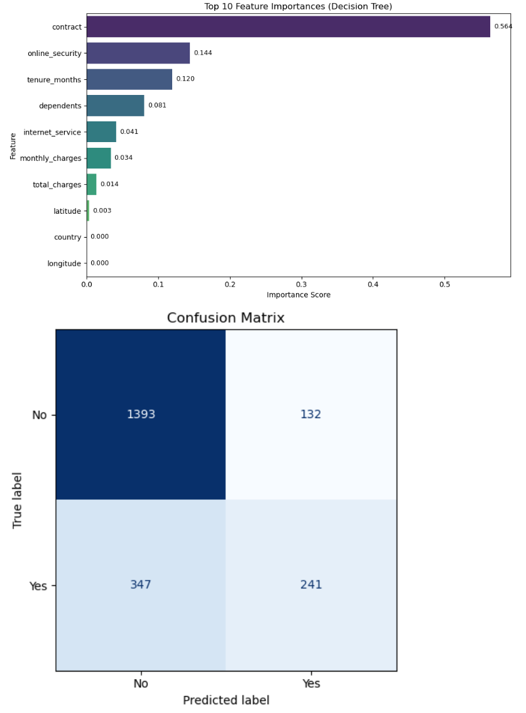
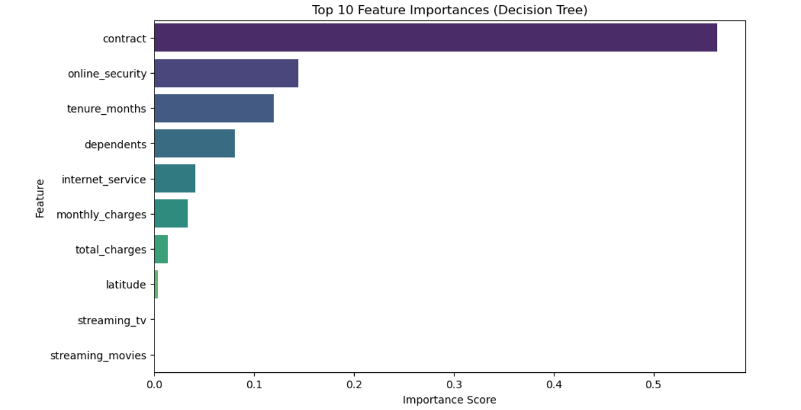

# 🌀 Customer Churn Analysis with Machine Learning
---
## 📌 Project Overview
Customer churn (the loss of clients or subscribers) is one of the most critical challenges businesses face. This project analyzes a telecom dataset to identify patterns and factors that contribute to customer churn. The analysis includes data cleaning, feature engineering, exploratory analysis, visualizations, and a machine learning model for churn prediction. Using Python, Pandas, Matplotlib, Seaborn, and Scikit-learn.

---
### Key goals:
* Understand patterns behind customer churn
* Visualize important metrics (e.g., churn by city, contract type, tenure).
* Predict churn using interpretable models and Building an interpretable predictive model.
* Provide business recommendations to reduce churn.
---

## 🔑 Key Features

*Exploratory Data Analysis (EDA):
  * Visualized churn by contract type, tenure, and payment methods.
  * Correlation heatmaps to understand feature relationships.
  * Segmentation of customers by tenure and contract type.

* Feature Engineering:
  * Created tenure bins for segmentation.
  * Encoded categorical variables.
  * Handled missing values and scaled numeric features.

* Machine Learning Models:
  * Logistic Regression for churn prediction.
  * Feature importance analysis using Decision Trees.
  * Evaluation with Confusion Matrix, Accuracy, Precision, Recall, and F1-score.

* Data Visualizations:
 * Churn rate comparison across categories (contract type, internet service, etc.).
 * Distribution plots and bar charts to highlight churn trends.
---
## 🛠️ Tools & Technologies
* Programming Language: Python
* Libraries: Pandas, NumPy, Matplotlib, Seaborn, Scikit-learn
* Environment: Jupyter Notebook
---
## 📂 Repository Structure
  
```
📁 Churn-Analysis

├── data/  
│   ├── raw/                
│
├── 📄 Churn_Analysis.ipynb      # Jupyter notebook with full analysis 
│
├── 📊 images/                   # Visualizations (churn by city, heatmaps, etc.
│   ├── churn_by_city.png  
│   ├── churn_by_contract.png  
│   ├── correlation_heatmap.png  
│   ├── tenure_segmentation.png  
│   ├── decision_tree_importance.png  
│   ├──  Decision.PNG
│   ├── churn_by_city.PNG
│   ├── churn_by_city_hover.PNG
│   ├── churn_by_contract.PNG
│   ├── churn_by_partner.PNG
│   ├── churn_count_for_DSL_internet_service.PNG
│   ├── churn_count_for_fiber_optic_service.PNG
│   ├── churn_count_for_internet_service.PNG
│   ├── churn_count_for_no_internet_service.PNG
│   ├── churn_count_for_online_security.PNG
│   ├── churn_count_for_tech_support.PNG
│   ├── churn_count_payment_method.PNG
│   ├── churn_distribution_by_dependents.PNG
│   ├── churn_rate_gender.PNG
│   ├── churn_rate_not_senior_citizen_status.PNG
│   ├── churn_rate_reason.PNG
│   ├── churn_rate_senior_citizen_status.PNG
│   ├── churn_reason_count_dependents.PNG
│   ├── churn_reason_count_not_dependents.PNG
│   ├── churn_reason_count_partner.PNG
│   ├── churn_reason_not_senior_citizen_status.PNG
│   ├── churn_reason_senior.PNG
│   ├── correlation_heatmap.PNG
│   └──  decision_confusion.PNG
│
├── scripts/                # Python scripts for reusable functions  
│   ├── data_preprocessing.py  
│   ├── visualization_utils.py  
│   └── modeling.py  
│
├── 📄 README.md                 # Project documentation (this file) 
└── requirements.txt  
```
---
## 🔍 Analysis Highlights
### 1. Data Cleaning & Preprocessing
- Removed duplicates, missing values, and irrelevant columns
- Encoded categorical variables for machine learning
- Engineered new features such as **tenure bins** for segmentation

### 2. Exploratory Data Analysis (EDA)
Analyzed churn patterns across multiple dimensions:
- **Contract Type**: Month-to-month customers churn the most
- **Tenure Groups**: Short-tenure customers are high-risk
- **Charges**: Higher charges show correlation with churn
- **Demographics**: Gender, Partner, Dependents
- **Services**: Tech Support, Online Security
- **Payment Method**: Electronic check users churn more
- **Customer Lifetime Value (CLV)**
- **Correlation Heatmap** for feature relationships

### 3. Visualizations
Key plots saved in `/images/`:
- Churn distribution by contract, tenure, age, and city
- Churn by partner/dependent status
- Service usage vs. churn (Online Security, Tech Support, etc.)
- Payment method vs. churn
- Feature correlation heatmap
- Model feature importance ranking

### 4. Machine Learning Model
- **Model**: Decision Tree Classifier  
- **Metrics**: Accuracy = 77%, with Precision, Recall, and F1-score  
- **Evaluation**: Confusion Matrix and Feature Importance plots

### 5. Business Insights
- Month-to-month contract customers are most likely to churn  
- Customers without online security or tech support show higher churn rates  
- Short-tenure customers are a high-risk segment  
- Certain payment methods (e.g., electronic checks) are linked to higher churn  

---
Key factors driving churn: Contract type, tenure, internet service, payment method.

## 📈 Results & Insights
* Customers on month-to-month contracts showed the highest churn rate.
* Electronic check payments were strongly associated with churn compared to automatic bank transfers or credit card payments.
* Tenure plays a big role: customers with shorter tenures are more likely to churn.
* Logistic Regression achieved a good baseline accuracy, while decision tree analysis revealed the most influential features.
---
 ## How to Run the Project
```
git clone https://github.com/PeterAnalyst/Customer_churn_Analysis.git
cd Customer_churn_Analysis
pip install -r requirements.txt
jupyter notebook Churn_Analysis.ipynb
```
or open it in Google Colab for an interactive experience.
 
---
# 👤 Author
👋 Hi, I'm Peter Junior Nwachineke – a passionate Data Analyst with hands-on experience in SQL, Power BI, Excel, and Python. I'm currently pursuing an MBA in International Business Management at ISTEC and building data projects that turn raw information into actionable insights. I'm especially interested in process automation, dashboard reporting, and helping businesses make smarter, data-driven decisions.

📧 [Email](peter.j.nwachineke@gmail.com)

🔗 [Connect with me on LinkedIn](https://www.linkedin.com/in/peter-j-nwachineke-819291247/)
